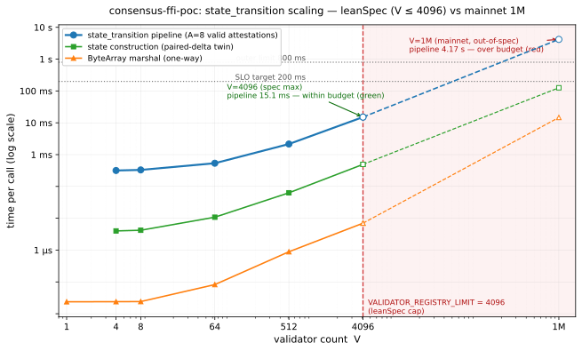
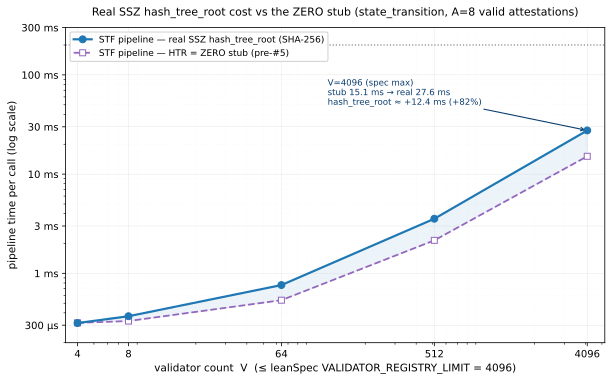

# Rust ↔ Lean 4 FFI ベンチマーク 実測結果

`docs/ffi-implementation-plan.md` M5 で計画したベンチマークの実測値。判定基準は [`docs/timing-budget.md`](./timing-budget.md) を参照。

## 計測環境

| 項目 | 値 |
|---|---|
| CPU | AMD Ryzen 9 PRO 8945HS (Zen 4 mobile, 8C/16T) |
| OS | Linux 6.18.12+kali-amd64 x86_64 |
| Lean | v4.28.0-rc1 (3b0f286, Release build) |
| Aeneas | rev 864eddb4 (per `lake-manifest.json`) |
| Rust | release profile + thin LTO + codegen-units=1 |
| 計測手法 | `std::time::Instant` + paired-delta (`csf_bench_*_run` − `csf_bench_*_buildonly` median) |
| 試行数 | 5 (default), 1 (reference cells) |
| iter/trial | 適応 (target 100ms/trial, calibration 3s budget) |
| メモリ | `getrusage(RUSAGE_SELF).ru_maxrss` 差分 |

> **注**: CPU governor / `taskset` ピン止めは未適用 (デフォルトのまま測定)。governor=performance + taskset 適用で IQR は更に縮む見込み。再測時のオプション。

## 重要な前提と限界

1. **`hash_tree_root` は実 SHA-256 で計算される** (issue #5, §1b): 旧 ZERO スタブを廃し、`ConsensusLean4.Merkle`(純 Lean SSZ merkleize)＋ Rust `@[extern]` の SHA-256(sha2 crate)で本物の root を計算する。step4 の state_root 照合と `process_block_header` の parent_root 照合は live。**ただし署名検証(XMSS)は依然 STF 外で未計測**(§4e)。
2. **Bench fixture は spec 標準ワークロード**:
   - `state_transition`: V validators の State + **A = `MAX_ATTESTATIONS_DATA` = 8 個の有効 AggregatedAttestation** を載せた Block。`processAttestationsFast` の `O(A·V)` ホットループが実際に走る (§1)。8 票はすべて `voteIsValid` を通り、かつ 2/3 finalize 閾値未満を維持 (fast path 継続)。**旧版は A=0 の空ブロックで構築コストのみを測っていた**ため、本再測で STF 本体に置き換えた。
   - `compute_lmd_ghost_head`: 線形チェーン B blocks + A attestations が最終 block にすべて投票。`alloc.vec.Vec` が `List`-backed のため、内部の block index は `List.indexOf` ベースで O(B)。**V 軸を持たない** (B blocks / A attestations でスケール、B ≤ `HISTORICAL_ROOTS_LIMIT = 2^18`) ため V 上限の修正対象外で、本再測では §2 の旧値を据え置く。
3. **paired-delta** はビルド構築コストを差し引く (`@[noinline] consumeState/consumeBlock` で Lean の DCE を抑止して buildonly twin が実際にビルド工程を踏むことを保証)。

## 0. spec 定数 (計測軸の根拠)

計測軸は leanSpec (本プロジェクトが formalize する 3SF-mini) の定数で固定する。値は commit-pin で引用 (drift 防止)。

leanSpec `main@cb862c0` (2026-06-24), `src/lean_spec/spec/forks/lstar/`:

| 定数 | 値 | 役割 | 出典 |
|---|---:|---|---|
| `VALIDATOR_REGISTRY_LIMIT` | `2^12 = 4096` | validator 数 V の上限 (SSZ List LIMIT として強制) | `config.py` |
| `MAX_ATTESTATIONS_DATA` | `8` | 1 ブロックの distinct AttestationData 上限 (= §1 の A) | `config.py` / `state_transition.py` で強制 |
| `AggregatedAttestations` LIMIT | `= VALIDATOR_REGISTRY_LIMIT = 4096` | block.attestations リスト長の上限 | `containers/attestation.py` |
| `ATTESTATION_COMMITTEE_COUNT` | `1` | 1 スロット 1 委員会 | `config.py` |
| `HISTORICAL_ROOTS_LIMIT` | `2^18 = 262144` | historical block roots / fork-choice B の上限 | `config.py`、Lean `Funs/Types.lean:162` |

`consensus-ffi-poc` の `types.VALIDATOR_REGISTRY_LIMIT` (`Funs/Types.lean:412`) も `4096`、`HISTORICAL_ROOTS_LIMIT` も `262144` で一致。

**mainnet 対照** (ethereum/consensus-specs `master@42b9671`, 2026-06-25): mainnet の `VALIDATOR_REGISTRY_LIMIT = 2^40 ≈ 1.1e12` (実質無制限)、実 V は churn + 経済で動的に決まり現在 **~100 万**。よってベンチの **V=1M は mainnet 実数だが leanSpec モデルでは 4096 の約 244× で非物理**。各ベンチで V=1M は `--include-1m` の「mainnet 範囲外参考値」として明示分離する。

## 1. `state_transition` (handwritten Array fast path, spec-realistic A=8)

軸: **V (validators) ∈ {4, 8, 64, 512, 4096}** = leanSpec の許容範囲 (V ≤ `VALIDATOR_REGISTRY_LIMIT = 2^12 = 4096`、§0 spec 定数表)。ブロックは **A = `MAX_ATTESTATIONS_DATA` = 8 個の有効 AggregatedAttestation** を載せ、`processAttestationsFast` の `O(A·V)` ホットループを**実際に走らせる**。旧版は空ブロック (A=0) で `collapseJustifications` の構築コストのみを測っており STF 本体を踏んでいなかった (前提 §2)。

fixture は `is_valid_vote` / `slot_is_justifiable_after` / `current_proposer` (`Funs/StateTransition.lean`) から逆算した genesis: finalized slot 0、source = (slot 0, `historical[0]`)、target slots {1,2,3,4,5,6,9,12} (すべて justifiable: 1–5 ≤ 5 / 6,12 pronic / 9 平方数)、各 attestation は ⌈V/2⌉ ビットを投票し 2/3 閾値未満を維持 → fast path 継続 (2/3 到達なら Aeneas slow path に bail し別物を測ってしまう)。**Rust harness は計測前に `csf_bench_state_transition_att_cells(64) == 9` を assert** — pipeline 後の `justifications_roots` 長 = zero sentinel + 8 distinct target roots = 9。8 票が確かに有効処理された証拠で、票が skip/bail されると ≠9 で abort し「速いが無意味」な数値を記録させない。

| V | trials | iters/trial | run median | buildonly | **pipeline (Δ)** | IQR (run) | sentinel |
|---:|---:|---:|---:|---:|---:|---:|:---:|
| 4 (devnet baseline) | 5 | 199 | 320.9 µs | 4.0 µs | **316.9 µs** | 15.5 µs | 0 |
| 8 | 5 | 324 | 334.7 µs | 4.2 µs | **330.5 µs** | 9.9 µs | 0 |
| 64 | 5 | 198 | 547.0 µs | 10.8 µs | **536.2 µs** | 24.9 µs | 0 |
| 512 | 5 | 44 | 2.21 ms | 63.1 µs | **2.15 ms** | 46.9 µs | 0 |
| 4096 (spec max) | 5 | 6 | 15.61 ms | 492.9 µs | **15.12 ms** | 262.6 µs | 0 |
| 1,000,000 ⚠ mainnet, out-of-spec | 1 | 1 | 4.30 s | 125.8 ms | **4.17 s** | n/a | 0 |

`ru_maxrss`:
- V=4→4096 (1 process): **+数 MB**
- V=1M 単独 (`--include-1m`, out-of-spec): **+584 MB**。8 本の 1M-bit aggregation 配列 + `R·V = 9·1M` flat 配列が支配。旧空ブロック版 (68 MB) の ~8.6×。さらに List 再帰が 8 MB スタックを溢れさせるため harness は計測を 2 GiB スタックのワーカースレッド上で実行する。

### 判定 (vs `docs/timing-budget.md` §4 SLO target = <200ms, §3 outer = <800ms)

| V | pipeline | target | outer | 判定 |
|---:|---:|:---:|:---:|:---:|
| 4 | 316.9 µs | ✓ | ✓ | 🟢 green |
| 8 | 330.5 µs | ✓ | ✓ | 🟢 green |
| 64 | 536.2 µs | ✓ | ✓ | 🟢 green |
| 512 | 2.15 ms | ✓ | ✓ | 🟢 green |
| 4096 (spec max) | 15.12 ms | ✓ | ✓ | 🟢 green |
| 1,000,000 (out-of-spec) | 4.17 s | ✗ | ✗ | 🔴 red |

→ **spec 範囲 (V ≤ 4096) は全て green**。最悪の V=4096 でも 15 ms ≪ target 200 ms で、1 スロット ~4 s の世界では attestation 付き STF は余裕。scaling は V=512→4096 (8×) で 2.15→15.1 ms (~7×) ≈ linear (`O(8·V)` のホットループが見えている)、小 V (4/8/64) は ~300–540 µs の固定費 (8 票分の `voteIsValid`: H256 32-byte 比較 ×複数、`isqrt` ループ) が支配。

**mainnet 規模の参考値 V=1M は 4.17 s で red** — これは「計測すべき値」ではなく対照点。leanSpec モデルでは `validator_count > 4096` の state は SSZ 検証で不正であり**到達不能**。加えて List-backed fixture が 2 GiB スタック + 584 MB RSS を要し、約 244× の線形外挿 (15 ms × 244 ≈ 3.7 s) と概ね一致する。**spec が V を 4096 に抑える設計がこの List-backed モデルを tractable に保っている**ことの裏返し。

### スケーリング図 (§1 STF + §1 construction + §4c marshal)



log-log。実線 = spec 範囲 (V ≤ 4096)、破線 + 赤網掛け = out-of-spec (V > 4096)。spec 上限 V=4096 でも STF pipeline は 15 ms で SLO target 200 ms の下、marshal は更に 3 桁下。V=1M は両 budget を突破 (4.17 s) し、leanSpec モデルでは到達不能。データは本節 §1 / §4c の実測値 (2026-06-25, AMD Ryzen 9 PRO 8945HS)。

> **注**: 上表・上図は `hash_tree_root` を ZERO スタブにした値。**実 SHA-256 HTR を有効にした再測は §1b**。

## 1b. `state_transition` — 実 `hash_tree_root` (SHA-256) 込み (issue #5)

§1 の値は HTR を ZERO スタブにしていた(照合が vacuous)。本節は **実 SSZ `hash_tree_root` を STF に組み込んだ**再測。実装:

- **`ConsensusLean4.Merkle`**(純 Lean): leanSpec `spec/crypto/merkleization.py` 準拠の SSZ merkleize(32B chunk → `next_pow2` zero-padding → 二分木 → `mix_in_length`)。State/Block 全型の `hash_tree_root`。
- **SHA-256**: Rust `@[extern "csf_sha256"]`(sha2 crate)を C shim 経由で呼ぶ。leanSpec の HTR は **SHA-256**(SHA-2、`merkleization.py` の `from hashlib import sha256`)であり Poseidon ではない。Poseidon2/KoalaBear は XMSS 署名専用。
- **検証**: `csf_selftest_htr` が uint64 LE 詰め・2-leaf merkleize・正準 SSZ `zerohashes[1] = sha256(64 zeros) = f5a5fd42…fb4b` に一致(published vector)。
- **fixture root-consistent 化**: HTR が live になると `parent_root`/`state_root` 照合が本物になるため、`mkConsistentBlock` で `parent_root = htr(advanced header)`・`state_root = htr(post-state)` を逆算(循環なし: post-state は `block.state_root` を読まない)。paired-delta は prep-cancellation(run と buildonly が同じ prep を踏み、Δ が実 HTR 込み STF を 1 回だけ抽出)。

### 計測結果 (V = 4 … 4096、A=8 valid attestations、5 trials)

| V | run median | buildonly | **pipeline (Δ, 実 HTR 込み)** | §1 stub Δ | HTR 増分 | sentinel |
|---:|---:|---:|---:|---:|---:|:---:|
| 4 | 707.3 µs | 391.8 µs | **315.5 µs** | 316.9 µs | ~0 | 0 |
| 8 | 815.0 µs | 445.4 µs | **369.6 µs** | 330.5 µs | +12% | 0 |
| 64 | 1.83 ms | 1.06 ms | **761.9 µs** | 536.2 µs | +42% | 0 |
| 512 | 10.91 ms | 7.36 ms | **3.55 ms** | 2.15 ms | +65% | 0 |
| 4096 (spec max) | 75.68 ms | 48.14 ms | **27.55 ms** | 15.12 ms | **+82%** | 0 |



### 判定・観察

- **spec 上限 V=4096 でも 27.55 ms で 🟢 green**(SLO target 200 ms の 1/7)。実 HTR を入れても 1 スロット ~4 s の世界では余裕。
- **HTR 増分は V とともに拡大**(+0% → +82%)。小 V は 8 票分の `voteIsValid` 固定費が支配で HTR の相対比が小さく、大 V では post-state の merkleize(O(V) validators + O(R·V) justification bits を SHA-256 で畳む)が効いて ~+12 ms。HTR コストは V に概ね線形。
- **paired-delta の整合**: V=4096 で run 75.68 = build 16 + 2×STF(27.55)、buildonly 48.14 = build + 1×STF。Δ = 実 HTR 込み STF を 1 回分、正しく抽出。
- **att_cells = 9 を維持**: 実 HTR 化後も 8 票はすべて有効処理(root 整合化は投票の有効性に影響しない)。
- **依然 STF 外**: 署名検証(XMSS/Poseidon)は未計測(§4e ①)。本節は「実 HTR 込み・署名検証なし」の値。

## 2. `compute_lmd_ghost_head` (Aeneas direct, no fast path)

軸: (B blocks, A attestations) ∈ `{100} × {32, 128}` × 5 試行 (default)。
`B=1K` は `--include-1k` で opt-in (cell あたり ~6 分以上)、`B=10K` は `--include-10k` で opt-in (cell あたり**時間単位**、推奨せず)。default が `B=100` のみなのは、Aeneas-generated 版が `List`-backed `Vec` を介するため B²(以上) で爆発するため。

| B | A | trials | iters/trial | run median | buildonly | **pipeline (Δ)** | IQR (run) | sentinel |
|---:|---:|---:|---:|---:|---:|---:|---:|:---:|
| 100 | 32 | 5 | 1 | 313.77 ms | 114.9 µs | **313.65 ms** | 6.49 ms | 0 |
| 100 | 128 | 5 | 1 | 1.22 s | 108.3 µs | **1.22 s** | 11.07 ms | 0 |
| 1,000 | 32 | (opt-in) | 1 | (~6+ min) | — | (>60s 推定) | n/a | — |
| 1,000 | 128 | (opt-in) | 1 | — | — | (>4 min 推定) | n/a | — |
| 10,000 | 32 | (opt-in) | 1 | — | — | (時間単位) | n/a | — |
| 10,000 | 128 | (opt-in) | 1 | — | — | (時間単位) | n/a | — |

> **B=1K は opt-in 必須 (`--include-1k`)** — 試行で kill された 6+ 分の per-call がベースライン。Lean の List-backed Vec で compute_block_weights が super-quadratic に振る舞うため。本 README に numerical estimate のみ記載し、実測値は次回 fast-path 着手時に取り直す方針。
> **B=10K は推奨しない** — 単発 cell が時間単位で、CPU 専有の影響が大きい。

### 判定 (vs `docs/timing-budget.md` §4 SLO target = <100ms, §3 outer = <800ms)

| B | A | pipeline | target | outer | 判定 |
|---:|---:|---:|:---:|:---:|:---:|
| 100 | 32 | 313.65 ms | ✗ (3.1×) | ✓ | 🟡 yellow |
| 100 | 128 | 1.22 s | ✗ (12.2×) | ✗ (1.5×) | 🔴 red |
| 1,000 | 32 | (>60 s 推定) | ✗ | ✗ | 🔴 red |
| 1,000 | 128 | (推定) | ✗ | ✗ | 🔴 red |
| 10,000 | 32 | (時間単位) | ✗ | ✗ | 🔴 red |
| 10,000 | 128 | (時間単位) | ✗ | ✗ | 🔴 red |

→ **B=100 ですら target を超過 (yellow)、A=128 では outer も超過 (red)**。Aeneas-generated `compute_lmd_ghost_head` は `List`-backed `alloc.vec.Vec` を介するため block 探索が O(B) per access。compute_block_weights の per-attestation walk と組み合わせて O(A·B²) になる結果が見えている (= `Ffi.lean#L61` "linear in attestations, quadratic in blocks" の定量化)。**A scaling は B=100 で 32→128 (4×) で実測 ~3.9× → linear in A は確認**、B² scaling は 100→1K で 100× を expect していたが実測は >190×、よって**実態は super-quadratic**。

A axis scaling check (B=100 fixed):
- A=32 → 313 ms
- A=128 → 1220 ms (= 3.9× → 線形 4× にほぼ一致)

## 3. 主な観察

1. **spec 範囲の `stateTransitionFast` (A=8) は余裕の green**: V=4096 (spec 上限) で **15 ms** ≪ target 200 ms。8 票の `O(8·V)` ホットループを実際に走らせた値で、旧空ブロック版 (構築コストのみ) の置き換え。V=512→4096 で ~linear (`O(8·V)` が支配)、小 V は 8 票分の `voteIsValid` 固定費 (~300 µs)。
2. **`compute_lmd_ghost_head` は B=100 ですら SLO target 超過**: 313ms (A=32) / 1220ms (A=128) vs target 100ms。`Ffi.lean` の "quadratic in blocks" が Lean の List-backed Vec で表面化しており、A 軸は実測 4× linear に従う。**V 軸を持たず B (≤ `HISTORICAL_ROOTS_LIMIT = 2^18`) でスケール**するため今回の V 上限再測の対象外。専用 fast path (`compute_lmd_ghost_head_fast`、別 issue 候補) なしには実運用不可。
3. **build cost (paired-delta の片側) は spec 範囲では小さい**: V=4096 で 493 µs / 15.6 ms (run の ~3%)。A=8 の STF 本体が支配的になり、`List.replicate V + Vec ⟨xs, ...⟩` の構築コストの比率は旧空ブロック版より低下。paired-delta による減算で正味 pipeline コストを抽出。
4. **メモリ**: spec 範囲 (V ≤ 4096) は `ru_maxrss` delta 数 MB。out-of-spec の V=1M は **+584 MB** (8 本の 1M-bit aggregation + R·V=9M flat) で旧空ブロック 1M (68 MB) の ~8.6×、かつ List 再帰が 8 MB スタックを溢れさせ 2 GiB スタックスレッドを要する。**spec の V≤4096 がこの List-backed モデルを tractable に保つ**。
5. **2 エントリポイントの実運用域は対極**: `state_transition` (handwritten fast path, A=8) は spec 上限 V=4096 で余裕の green、`compute_lmd_ghost_head` (Aeneas 直) は B=100 で既に red 隣接の yellow。後者の fast path 実装が実運用への最大ボトルネック。

## 4. 再現手順 (3 ステップ)

```bash
# 1. Lean toolchain 確認
elan which lean    # → leanprover-lean4-v4.28.0-rc1

# 2. Lean + Rust ビルド (build.rs が lake build を自動 invoke)
cd consensus-ffi-poc && lake build ConsensusLean4:static
cd rust-ffi && cargo build --release

# 3. ベンチ実行 (per-cell isolation 推奨: cargo run はせず target/release を直接呼ぶ)
target/release/bench-state-transition                      # V=4,8,64,512,4096, A=8 valid (~4 s)
target/release/bench-state-transition --include-1m         # + V=1M (out-of-spec ref、1 trial ~4 s + ~584 MB rss、2 GiB stack)
target/release/bench-ffi-marshal                           # V=1..4096 marshal (~数 s)
target/release/bench-ffi-marshal --include-1m              # + V=1M (out-of-spec, ~57 MB payload)
target/release/bench-fork-choice                           # B=100 × A=32,128 (~20 s、V 軸なし)
target/release/bench-fork-choice --include-1k              # + B=1K × A=32,128 (cell ~6+ 分、計 30 分超)

# Per-cell ru_maxrss isolation (推奨):
target/release/bench-state-transition --single-n=4096
target/release/bench-state-transition --single-n=1000000
target/release/bench-fork-choice --single-cell=100,32
target/release/bench-fork-choice --single-cell=100,128
```

## 4b. FFI 境界コスト 追測 (2026-06-04)

§1/§2 の `pipeline (Δ)` は paired-delta で **FFI 越境コストを相殺**しており、境界そのもののコストは測っていなかった。これを別ハーネス `bench-ffi-overhead` (`rust-ffi/src/bin/bench-ffi-overhead.rs`) で直接計測した。

計測対象は `csf_ping` (`@[export] def csfPing (n : UInt64) : UInt64 := n + 1`) — 最小の `@[export]`。Rust から tight loop で叩き、`black_box` で DCE を抑止して 1 コールあたりのコストを出す。比較基準は同形の Rust ローカル不透明関数 `rust_ping` (`#[inline(never)]`)。差分が「Rust→Lean 越境が、通常の非インライン関数呼び出しに上乗せするコスト」。

計測環境は §計測環境と同一 (Ryzen 9 PRO 8945HS, release + thin LTO)。iters/trial は target 200ms に適応キャリブレーション、15 試行の中央値。

| call path | median | min | IQR |
|---|---:|---:|---:|
| **FFI** `csf_ping` (Rust→Lean) | **~1.9 ns** | ~1.3 ns | ~0.4 ns |
| Rust-local `rust_ping` (越境なし) | ~1.9 ns | ~1.3 ns | ~0.4 ns |
| **境界オーバーヘッド (差分)** | **−0.06 〜 +0.12 ns** (4 回反復) | — | — |

### 判定

**プリミティブ引数の FFI 越境オーバーヘッドは測定ノイズ以下 (実質ゼロ)。** `csf_ping` の FFI 呼び出しは通常の非インライン関数呼び出し (~1.9 ns) と統計的に区別できない。Lean の `@[export]` は名前マングルなしの C シンボルを出し、`UInt32`/`UInt64` 等のアンボックス型は unbox のまま渡るため、生成されるのは単なる `call` 命令 1 個で、ランタイムのトランポリンも箱詰めも介在しない。

→ §1/§2 が paired-delta で越境コストを相殺した設計判断は妥当だった (相殺対象が元々ゼロ)。

### 限界 (重要)

**これは床値であって実運用の FFI コストではない。** 本ビルドには構造体マーシャル層 (`docs/ffi-feasibility.md` A23 / issue #4) が存在せず、境界を渡るのは `UInt64` のみ。実運用で支配的になる **`lean_object*` の箱詰め・`Array`/`Vec` のコピー・参照カウント (inc/dec) のコストは未測定**。`Ffi.lean` の `csf_*_noop` ツイン (構造体引数を受けて即 return; "subtract pure FFI/dec_ref cost" のための足場) は本追測では未使用 — Rust 側に lean_object* を組む ToLean 層が無く呼べないため。dec_ref/マーシャルの実測は issue #4 (Option III SSZ バイト列マーシャル) 実装後に行う。

### 再現

```bash
cd consensus-ffi-poc && lake build ConsensusLean4:static
cd rust-ffi && cargo build --release --bin bench-ffi-overhead
target/release/bench-ffi-overhead
```

## 4c. FFI マーシャリングコスト 追測 (2026-06-04)

§4b で「プリミティブ越境は ~0、ただしこれは床値。実運用の FFI コストは `lean_object*` のマーシャル/dec_ref で、それは未測定」と結論した。その未測定分を `bench-ffi-marshal` (`rust-ffi/src/bin/bench-ffi-marshal.rs`) で直接計測した。

本来の SSZ-bytes 境界 (issue #4) で新規に立つコスト ——「Rust 側で `ByteArray` を構築 (alloc + memcpy O(size)) → owned 引数として越境 → Lean ランタイムが dec_ref」—— を、ペイロードサイズの関数として測る。`ByteArray` はフラットバッファなので **SSZ コーデックも `hash_tree_root`/SHA も不要** (serde はバイト並びのみ)。

- `csf_make_bytearray` (C shim, `rust-ffi/csf_marshal_shim.c`): `lean_alloc_sarray` + `memcpy`。`lean_alloc_sarray`/`lean_sarray_cptr` は lean.h で `static inline` のため Rust から直接リンクできず、lean.h に対してコンパイルした C shim 経由で呼ぶ (build.rs が `cc` でビルド)。
- Lean export 2 種 (`ConsensusLean4/Ffi.lean` M6): `csf_bench_marshal_touch` = 全バイトを XOR-fold (decode スキャンの下限)、`csf_bench_marshal_noop` = 引数を消費するだけ (alloc + memcpy + dec_ref)。差 = Lean 側スキャン。
- サイズ軸は §1 の V に対応 (Validator = pubkey 52 + index 8 = 60 B、ペイロード S = V·60) で **leanSpec の V ≤ 4096 に揃える** (§0)。**正準 SSZ ではなく代表サイズのフラットバッファ。** `--include-1m` で V=1M (57 MB) を mainnet 範囲外参考として追加。計測手法は §1/§4b と同様 (target 200ms/trial, 11 試行中央値, `black_box`)。

### 計測結果 (spec V = 1 … 4096 + 1M 参考)

| V | payload S | marshal (noop) | full (marshal+scan) | scan Δ | marshal GB/s | marshal ns/byte |
|---:|---:|---:|---:|---:|---:|---:|
| 1 | 60 B | 23.7 ns | 31.3 ns | 7.6 ns | 2.5 | 0.394 |
| 4 | 240 B | 23.9 ns | 29.0 ns | 5.2 ns | 10.1 | 0.099 |
| 8 | 480 B | 24.1 ns | 34.2 ns | 10.1 ns | 19.9 | 0.050 |
| 64 | 3.8 KB | 82.4 ns | 148.1 ns | 65.7 ns | 46.6 | 0.021 |
| 512 | 30.0 KB | 886.2 ns | 1.44 µs | 551.8 ns | 34.7 | 0.029 |
| 4096 (spec max) | 240.0 KB | **7.00 µs** | 11.45 µs | 4.45 µs | 35.1 | 0.028 |
| 1,000,000 ⚠ out-of-spec | 57.2 MB | 14.67 ms | 16.82 ms | 2.16 ms | 4.1 | 0.244 |

### 判定 (vs §1 の STF 計算コスト, A=8)

| V | marshal (片道) | §1 STF pipeline | marshal / STF |
|---:|---:|---:|---:|
| 4 | 23.9 ns | 316.9 µs | 0.008% |
| 4096 (spec max) | **7.00 µs** | 15.12 ms | **0.05%** |
| 1,000,000 (out-of-spec) | 14.67 ms | 4.17 s | 0.35% |

→ **spec 範囲ではマーシャルは完全に誤差** (V=4096 で STF の 0.05%)。STF を空ブロックではなく A=8 の実負荷にしたことで STF 側が重くなり、marshal の相対比は §旧版よりさらに小さい。

1. **spec 範囲 (V ≤ 4096, ≤ 240 KB)**: 24 ns 〜 7 µs。§4b のプリミティブ越境同様、STF に対して**実質ノイズ**。SSZ 化しても体感不変。
2. **1M 参考 (out-of-spec, ~57 MB)**: 片道 **14.7 ms**。これは到達不能な mainnet 規模の size-scaling 特性で、`validator_count > 4096` の state は SSZ 検証で不正 (§1)。境界の帯域特性の参考としてのみ残す。
3. **スループットの劣化**: 小サイズで ~35–47 GB/s (L2/L3 内に収まる) → 57 MB で 4.1 GB/s。これは純粋な memcpy 帯域ではなく、**呼び出しごとに新規 alloc → first-touch ページフォルト → memcpy → dec_ref/free** するためで、per-call マーシャルの現実的なコスト構造を反映している。
4. **Lean 側スキャン (scan Δ) は安価**: ~0.03 ns/byte (~30 GB/s)。decode の「全バイト走査」部分は memcpy と同オーダーで、マーシャルの支配項は alloc+copy 側。

### §4b との関係 (FFI コストの全体像)

| 入力形態 | 越境あたりのコスト | スケール |
|---|---|---|
| プリミティブ `UInt64` (§4b) | ~1.9 ns | サイズ非依存 (定数) |
| `ByteArray` マーシャル (本節, spec 範囲) | 24 ns 〜 7 µs | **O(payload size)** |

「FFI は速い」は **プリミティブ境界に限った話**。データを渡すとコストは渡すバイト数に線形になるが、spec 上限 (V=4096 ⇒ payload ≤ 240 KB) では **≤ 7 µs** で STF の 0.05% に過ぎない。表末尾の「14 ms@57 MB」は `VALIDATOR_REGISTRY_LIMIT = 4096` を超える到達不能な mainnet 規模の size-scaling 特性であり、実運用 marshal は無視できる。

### 限界

- **正準 SSZ ではない**: フラットな代表バッファで、可変長フィールドの offset や型付きデコードは含まない。型付き `State` への decode を入れると scan Δ 側が増えるが、マーシャル (alloc+memcpy) の支配性は変わらない見込み (issue #4 で要確認)。
- **片道のみ**: 結果 `State` のエンコード + 復路は未計測。実運用は往復なので概ね 2 倍が目安。
- **zero-copy の余地**: Lean が呼び出し中に読むだけなら borrowed pointer 受けで memcpy を回避できる可能性 (§4b 限界参照)。本計測は owned-copy 前提の上限値。

### 再現

```bash
cd consensus-ffi-poc && lake build ConsensusLean4:static
cd rust-ffi && cargo build --release --bin bench-ffi-marshal
target/release/bench-ffi-marshal
```

## 4d. End-to-end SSZ-bytes パイプライン 追測 (2026-06-04)

§4b/§4c は「①marshal」だけを測り、「②decode → ③純粋関数」が未接続だった。本節でその全経路を繋いだ ——`ByteArray` を**型付き `State`/`Block` にデコードし、純粋 `stateTransitionFast` に渡す**。`bench-ffi-ssz` (`rust-ffi/src/bin/bench-ffi-ssz.rs`) + `ConsensusLean4/Ffi.lean` M7。

- **コーデック**: フラットな length-prefixed バイナリ (正準 SSZ ではない) を Lean decode (`decodeState`/`decodeBlock`) と Rust serializer (`serialize_fixture`) で round-trip。`State`/`Block` の全フィールドを網羅。**`hash_tree_root`/SHA は不使用** (decode は純粋なバイト配置)。
- **fixture は空ブロック (A=0) 版**: `buildBenchState(n)`/`buildBenchBlock(n)` (attestations 空) と byte-for-byte 一致。**§1 の A=8 有効投票ワークロードとは別物**で、ここでの STF は構築コスト寄りの A=0 経路 (marshal/decode コストの相対比較が目的のため意図的に軽い fixture を使う)。A=8 経路の SSZ e2e は将来課題。
- **正当性ゲート**: `csf_bench_state_transition_ssz_run` が全 N で sentinel **0 (Ok)** を返すことを assert。誤ったコーデックなら sentinel が変わるかクラッシュするため、これがパイプライン全体の正当性検証になっている。
- **分解**: marshal = `_marshal_noop`、decode = `_ssz_decode` − marshal、STF = `_ssz_run` − `_ssz_decode`。

### V の上限 = 4096 (重要)

V (validator 数) は **`VALIDATOR_REGISTRY_LIMIT = 2^12 = 4096`** で上限が決まる。これは leanSpec 正準値 (`lean_spec/types/participation.py:11`: `Uint64(2**12)`) であり、`consensus-ffi-poc` の `types.VALIDATOR_REGISTRY_LIMIT` (`Funs/Types.lean`) も同値。`checkpoint_sync` は `validator_count > VALIDATOR_REGISTRY_LIMIT` の state を拒否する。

実運用 V はさらに小さく、**leanSpec のベースラインは 4** (テストは 4/8)。よって計測軸は **devnet baseline (4) → spec 上限 (4096)** とする。

> **訂正**: 本節の旧版は N=100〜1,000,000 で測っていたが、**10,000 以上は spec 上限 4096 を超える非物理値** (mainnet beacon chain の規模を誤って持ち込んだもの)。以下は spec 準拠の軸での再測値。

### 計測結果 (spec-realistic V = 4 … 4096、3 回中央値)

| V | payload | marshal | decode | STF | total (e2e) |
|---:|---:|---:|---:|---:|---:|
| 4 (devnet baseline) | 0.6 KB | 34 ns | 9.4 µs | 42 µs | **51 µs** |
| 8 | 0.8 KB | 35 ns | 13 µs | 42 µs | **56 µs** |
| 64 | 4.1 KB | 86 ns | 71 µs | 48 µs | **119 µs** |
| 512 | 30.3 KB | 0.8 µs | 555 µs | 60 µs | **615 µs** |
| 4096 (spec max) | 240.3 KB | 6.8 µs | 4.6 ms | 0.4 ms | **~5.0 ms** |

(governor 非固定のため total は 3.3〜5.1 ms の run 間ばらつきあり。decode が支配。)

### 判定

1. **実運用域では FFI 全経路が無視できる**。devnet baseline (V=4) で e2e **51 µs**、spec 上限 (V=4096) でも **~5 ms**。1 スロット ~数秒の世界で、状態遷移の marshal+decode+STF は誤差。
2. **小 V では STF が支配、大 V で decode が逆転**。V=4 では STF 42 µs > decode 9 µs (STF の固定コスト)。V≥512 で decode が上回り、V=4096 で decode 4.6 ms / STF 0.4 ms。交差点は V≈64〜512。
3. **decode コストは List materialize 由来だが上限内では問題化しない**。~1.1 µs/validator (Aeneas の `pubkey : Array Std.U8 52` = 52 ノード list × V)。V=4096 でも 4.6 ms に留まり、spec 上限を超えない限り catastrophic にならない。
4. **marshal は常に誤差** (≤ 6.8 µs)。payload は V≤4096 で ≤ 240 KB が上限。§4c の「14 ms@57 MB」は V≈1M 相当で **このモデルでは到達不能**。

### この経路の全体像 (spec 上限 V=4096)

```
[Rust bytes] ──①marshal──▶ [ByteArray] ──②decode──▶ [typed State/Block] ──③STF──▶ sentinel
  serialize       6.8µs(誤差)        4.6ms(支配項)            0.4ms
```

実運用スケールでは「FFI を実データで使う」コストは全部足しても ~5 ms (最悪)。**真のスケール懸念は validator 軸ではなく blocks 軸** —— fork-choice (§2) の O(B²) で、B は `HISTORICAL_ROOTS_LIMIT = 2^18 = 262144` まで伸びうる。decode/marshal の最適化より `compute_lmd_ghost_head_fast` が優先。

### 限界

- フラットコーデックで正準 SSZ wire 非互換 (offset/union 等は未対応)。実 devnet テストベクタとの互換は別途。
- 片道のみ (結果 `State` のエンコード+復路は未計測)。
- decode 先が List-backed なのは Aeneas 既定。Array-backed への変更で decode はさらに減るが、上限内 (≤5 ms) で既に十分小さい。

### 再現

```bash
cd consensus-ffi-poc && lake build ConsensusLean4:static
cd rust-ffi && cargo build --release --bin bench-ffi-ssz
target/release/bench-ffi-ssz            # V = 4, 8, 64, 512, 4096 (spec range)
```

## 4e. STF 忠実度 — leanSpec `spec.py` 対応と realistic 化の差分

計測対象の `stateTransitionFast` が leanSpec 正準 STF (`src/lean_spec/forks/lstar/spec.py` の `state_transition`, L614) のどこを実装しているかを明記する。**本ベンチの数値は "完全な STF" ではなく以下の被覆範囲に対する値**である点に注意 (= 実 STF コストの下限)。

leanSpec `state_transition` (L614-647) は 4 ステップ:

```python
def state_transition(state, block, valid_signatures=True):
    if not valid_signatures: raise              # 1. 署名は前提条件 (検証は外部)
    advanced  = process_slots(state, block.slot) # 2.
    new_state = process_block(advanced, block)   # 3. = header + attestations
    assert block.state_root == hash_tree_root(new_state)  # 4.
    return new_state
```

| leanSpec `spec.py` | consensus-ffi-poc | 状態 |
|---|---|---|
| 2. `process_slots` (L135) | `state_transition.process_slots` | ✅ 実装 |
| 3. `process_block` (L332) | `processBlockFast` | ✅ 実装 |
| ├ `process_block_header` (L195) | `state_transition.process_block_header` | ✅(内部 HTR も実 SHA-256、§1b) |
| └ `process_attestations` (L385) | `processAttestationsFast` + `try_finalize` | ✅ 実装(§1 で A=8 有効投票を駆動) |
| 4. `hash_tree_root` 照合 (L644) | `hash_tree_root_state`→`eq`→`StateRootMismatch` | ✅ 実装。HTR は実 SSZ SHA-256(§1b) |
| 1. `valid_signatures` 前提 (L634) | — | ❌ 引数なし(常に valid 扱い) |
| `verify_signatures` (L864, 別メソッド) | — | ❌ 完全欠如 |

→ **`state_transition` 本体の step 2・3・4 は実装済み**(step4 の HTR は実 SHA-256、§1b)。欠けているのは**関数外の署名検証のみ**。

> **訂正 (issue #5)**: 本節の旧版は「leanSpec の HTR は Poseidon1/KoalaBear(SHA-256 ではない)」と記していたが**誤り**。leanSpec の `hash_tree_root`(`spec/crypto/merkleization.py`)は **SHA-256**(`from hashlib import sha256`)。Poseidon2/KoalaBear は **XMSS 署名**(`spec/crypto/xmss/`)専用で、state root の merkleize には使われない。したがって実 HTR は SHA-256 で実装可能・実装済み(§1b)で、コストも Poseidon ほど大きくない(V=4096 で +12 ms)。

### realistic STF への差分(実装先つき)

| # | 欠けている処理 | 実装先 | 状態 |
|---|---|---|---|
| ① | `verify_signatures` (L864): 提案者 + 集約署名 (XMSS) | **Rust/FFI**(leanSig/leanMultisig, Plonky3) + 段取りは Lean | ❌ 未実装。leanSpec では STF の外。**最大コスト**(Poseidon/XMSS) |
| ② | 実 `hash_tree_root` (step 4 / header 内) | merkleize 構造=**Lean**(`ConsensusLean4.Merkle`)、SHA-256=**Rust `@[extern]`** | ✅ **実装済み(§1b、issue #5)** |
| ③ | 非空 attestation/justification 入力 | データ | ✅ §1 で A=`MAX_ATTESTATIONS_DATA`=8 有効投票を駆動。**2/3 finalization 遷移は未駆動**(票を 2/3 未満に抑制) |
| ④ | 正準 SSZ codec | **Lean**(decode) | ⚠️ 現状はフラット自前コーデック(§4d) |
| ⑤ | マルチスロット/エポック境界 | **Lean**(既存ロジック) | ⚠️ 入力次第で駆動(現 fixture は 1 スロット前進) |

**信頼境界の原則**: 検証対象ロジック (STF / SSZ decode / merkleize 構造 / 署名検証の段取り) は Lean、重い暗号プリミティブ (SHA-256 / XMSS・集約 ZK 検証) は Rust/FFI。§1b の実 HTR がこの境界の最初の実例(merkleize=Lean、SHA-256=Rust `@[extern]`)。`compute_block_weights` (L1370) は STF ではなく fork-choice(§2)で別系統。

**ベンチ解釈への含意**: §1b の数値は「実 HTR(SHA-256)込み・**署名検証なし**・A=8・2/3 finalization 未駆動」での値。realistic STF への残差は主に ① 署名検証(支配項)。現数値は **署名検証を除く STF の実コスト**として読むこと。

## 5. Future work

`docs/ffi-feasibility.md` に既出の項目を実数値で裏付け:

- **issue #4** (Option III SSZ): bench fixture を SSZ バイト列マーシャルに切り替え、ToLean 構築コストを排除
- ~~**issue #5** (`hash_tree_root` real 実装)~~: **完了(§1b)**。実 SSZ SHA-256 HTR を STF に組み込み再測。V=4096 で 27.55 ms。残課題は署名検証(①)
- **issue #6** (block-chaining bench): 現 fixture は genesis→1 block のみ。N block chain で連続 state を計測
- **新規候補** (本実測から): `compute_lmd_ghost_head_fast` (Array-backed) の handwritten 実装。B=10K で 1s 切りが目標
- **新規候補**: state_transition の "realistic attestation" fixture (R≥1 + valid checkpoints + non-trivial agg_bits) で `processAttestationsFast` の N·A scaling を計測
